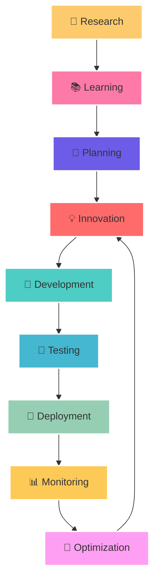

# <div align="center">🌟 VISHAL PANDEY 🌟</div>

<div align="center">
  
</div>

<div align="center">
  
</div>

<div align="center">
  
</div>

---

##  **🧙‍♂️ ABOUT THE ARCHITECT**

<div align="center">
  
</div>


```javascript
const vishal = {
    🎯 role: "Backend Alchemist 🧙‍♂️",
    📍 location: "Somewhere in the Cloud ☁️",
    🔥 currentFocus: "Distributed Systems & Microservices",
    💭 philosophy: "Code is poetry, systems are symphonies 🎵",
    ⚡ superpower: "Turning ☕ into scalable systems 🏗️",
    
    🕒 dailyRoutine: {
        🌅 morning: "☕ Coffee + 📊 System Metrics",
        🌞 day: "🔨 Building + 🐛 Debugging",
        🌆 evening: "📚 Learning + 🌟 Innovating",
        🌙 night: "💤 Dreaming in JSON"
    },
    
    ✨ stats: {
        🎯 codeQuality: "Production-Ready Always 🚀",
        🐛 bugCount: "Approaching Zero 🎯",
        ⚡ caffeineLevel: "Maximum",
        🔥 passionLevel: "Over 9000!"
    }
};
```

<div align="center">
  
</div>

---

##  **🛠️ TECH ARSENAL**

<div align="center">
  
</div>

###  **🚀 Backend Mastery**
<div align="center">
  
  
  
  
  
  
</div>

###  **🗄️ Database Wizardry**
<div align="center">
  
  
  
  
  
</div>

###  **☁️ Cloud & DevOps Arsenal**
<div align="center">
  
  
  
  
  
  
</div>

###  **💻 Frontend & Tools**
<div align="center">
  
  
  
  
  
  
</div>

<div align="center">
  
</div>

---

##  **📊 GITHUB UNIVERSE**

<div align="center">
  
</div>

<div align="center">
  <table>
    <tr>
      <td>
        
      </td>
      <td>
        
      </td>
    </tr>
  </table>
</div>

<div align="center">
  
</div>

<div align="center">
  
</div>

---

##  **🏆 ACHIEVEMENT VAULT**

<div align="center">
  
</div>

<div align="center">
  
</div>

 

<div align="center">
  
</div>

---

##  **📊 CODE METRICS DASHBOARD**

<div align="center">
  
</div>

<div align="center">
  <table>
    <tr>
      <td></td>
      <td></td>
    </tr>
    <tr>
      <td></td>
      <td></td>
    </tr>
  </table>
</div>

###  **⚡ Performance Metrics**
<div align="center">
  
  
  
  
</div>

<div align="center">
  
</div>

---

##  **🎯 CURRENT MISSION**

<div align="center">
  
</div>



###  **📈 2024 Roadmap**
<div align="center">
  
  
  
  
</div>

<div align="center">
  
</div>

---

##  **🌐 CONNECT & COLLABORATE**

<div align="center">
  <a href="https://www.linkedin.com/in/vishal-kumar-3835a9330/">
    
  </a>
  <a href="mailto:your.email@example.com">
    
  </a>
  <a href="https://twitter.com/yourhandle">
    
  </a>
  <a href="https://medium.com/@yourhandle">
    
  </a>
  <a href="https://dev.to/yourhandle">
    
  </a>
  <a href="https://discord.gg/yourserver">
    
  </a>
</div>

###  **🤝 Let's Build Together!**
<div align="center">
  
  
  
</div>

<div align="center">
  
</div>

---

##  **🐍 SNAKE GAME (Watch My Contributions!)**

<div align="center">
  
</div>

<div align="center">
  
</div>

---

##  **📊 VISITOR ANALYTICS**

<div align="center">
  
</div>

 

<div align="center">
  
</div>

---

<div align="center">
  
</div>

<div align="center">
  <h3>💭 <em>"Code is like humor. When you have to explain it, it's bad."</em> - Cory House</h3>
  <h2>🌟 <strong>Let's build something amazing together!</strong> 🌟</h2>
</div>

<div align="center">
  
</div>

<div align="center">
  
</div>
